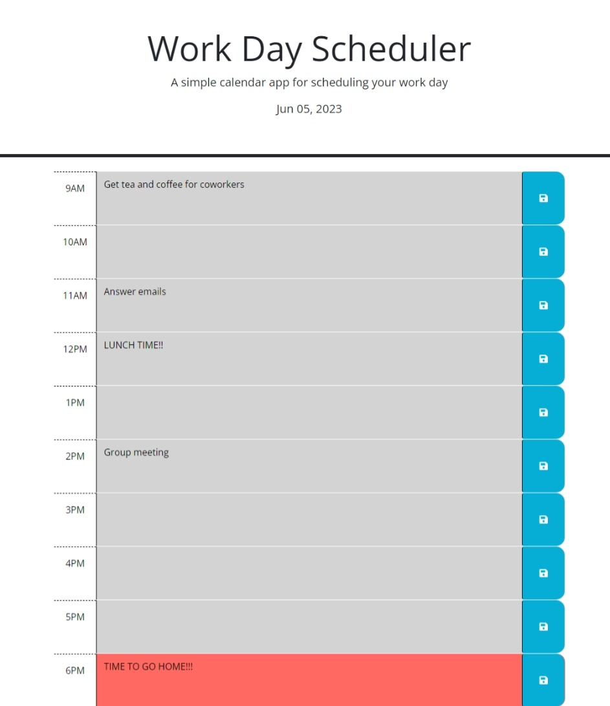

# week5-challenge

## Description

This daily planner was missing some features when the code was recieved. In terms of visual features, today's date will now be displayed above the calendar and there are now time slots for a full work day.

In terms of functionality, the save buttons beside the entry areas will save whatever text is within them to local storage. If the user leaves the page and returns, the previous information will be displayed for them. Additionally, the text areas will be highlighted in different colours depending on the time of day. It will show what events have past, what is happening now, and what is upcoming all in different colours.

## Usage

The user can enter any information they wish in to the text boxes. When they click the associated save button, then the information will be saved locally. If the user refreshes the page or closes it and comes back later, then anything that was saved will persist.

## Visual

## URLs

[This is the GitHub repository for this webpage](https://github.com/Shippo704/week5-challenge)

[This is the deployed webpage](https://shippo704.github.io/week5-challenge/)